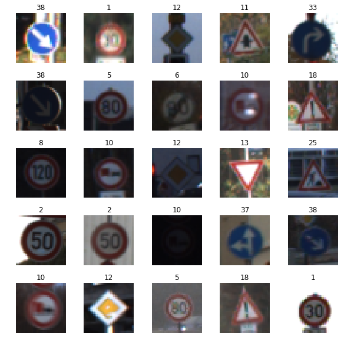
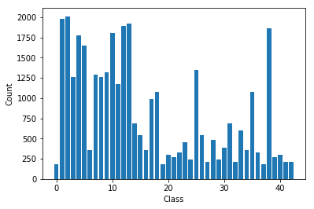
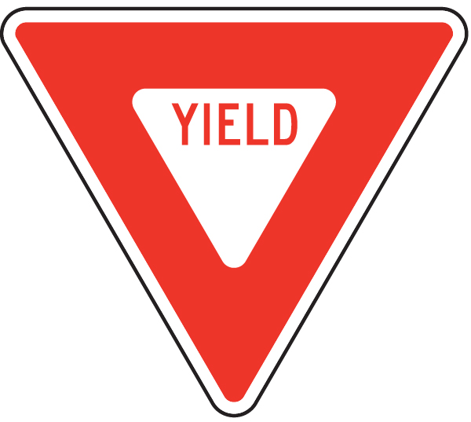
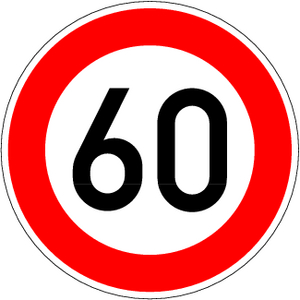
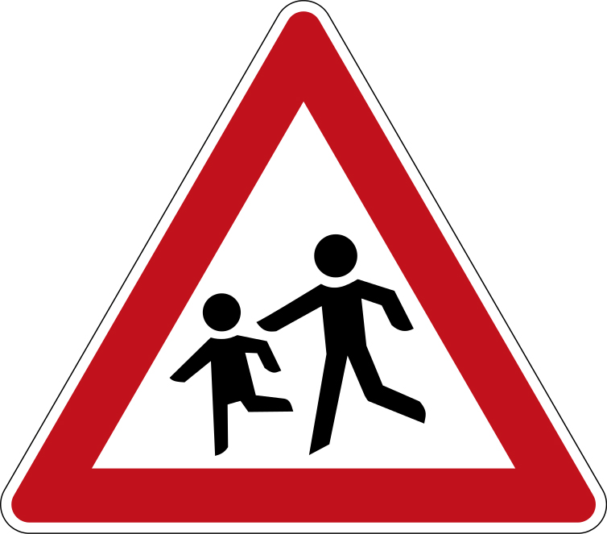

**Traffic Sign Recognition**

---

**Build a Traffic Sign Recognition Project**

The goals / steps of this project are the following:
* Load the data set (see below for links to the project data set)
* Explore, summarize and visualize the data set
* Design, train and test a model architecture
* Use the model to make predictions on new images
* Analyze the softmax probabilities of the new images
* Summarize the results with a written report

## Rubric Points
###Here I will consider the [rubric points](https://review.udacity.com/#!/rubrics/481/view) individually and describe how I addressed each point in my implementation.  

---
###Writeup / README

####1. Provide a Writeup / README that includes all the rubric points and how you addressed each one. You can submit your writeup as markdown or pdf. You can use this template as a guide for writing the report. The submission includes the project code.

You're reading it! and here is the links to my project on github
- [Jupyter Notebook](https://github.com/chris-paton/CarND-Traffic-Sign-Classifier-Project/blob/master/Traffic_Sign_Classifier.ipynb)
-[Output for the project - pdf](https://github.com/chris-paton/CarND-Traffic-Sign-Classifier-Project/blob/master/Traffic_Sign_Classifier.pdf)
-[Output for the project -html](https://github.com/chris-paton/CarND-Traffic-Sign-Classifier-Project/blob/master/Traffic_Sign_Classifier.html)
-[Test images](https://github.com/chris-paton/CarND-Traffic-Sign-Classifier-Project/tree/master/testimages)

###Data Set Summary & Exploration

####1. Provide a basic summary of the data set and identify where in your code the summary was done. In the code, the analysis should be done using python, numpy and/or pandas methods rather than hardcoding results manually.

The code for this step is contained in the second code cell of the IPython notebook.  

I used the numpy library to calculate summary statistics of the traffic
signs data set:

* The size of training set is 34799
* The size of test set is 12630
* The shape of a traffic sign image is 32, 32, 3
* The number of unique classes/labels in the data set is 43

####2. Include an exploratory visualization of the dataset and identify where the code is in your code file.

The code for this step is contained in the third code cell of the IPython notebook.  

These are a random selection of 25 images from the training dataset:

Here is a plot of the classes in the training dataset.

###Design and Test a Model Architecture

####1. Describe how, and identify where in your code, you preprocessed the image data. What tecniques were chosen and why did you choose these techniques? Consider including images showing the output of each preprocessing technique. Pre-processing refers to techniques such as converting to grayscale, normalization, etc.

Image processing:
I finalised on two functions to preprocess the images for this project which can be found in the sixth code cell. Brightness augmentation and then Normalised image.

####2. Describe how, and identify where in your code, you set up training, validation and testing data. How much data was in each set? Explain what techniques were used to split the data into these sets. (OPTIONAL: As described in the "Stand Out Suggestions" part of the rubric, if you generated additional data for training, describe why you decided to generate additional data, how you generated the data, identify where in your code, and provide example images of the additional data)

In code cell 5 is the step taken to split up the data using sklearns train_test_split

####3. Describe, and identify where in your code, what your final model architecture looks like including model type, layers, layer sizes, connectivity, etc.) Consider including a diagram and/or table describing the final model.

The code for the final model I used is based on the standard LeNet, during testing I was having problems with overfitting, my Test Accuracy = 0.862 and my Training Accuracy = 0.968 and the Validation accuracy would drop every 8 to 10 epochs. I added and additional dropout to both of the Convolutional layers between the activation and pooling which made a big difference in consistency by reducing overfitting.

My final model consisted of the following layers:

| Layer         		|     Description	        					|
|:---------------------:|:---------------------------------------------:|
| Input         | 32x32x1   			 |
| Convolution   | outputs 28x28x6  |
| RELU					|									 |
| Dropout       | 0.8              |
| Max pooling   | inputs 28x28x6 outputs 14x14x6 |
| Convolution   | outputs 10x10x16 |
| RELU          |                  |
| Dropout       | 0.8              |
| Max pooling	  | outputs 5x5x16 	 |
| Flatten       | outputs 400      |
| Fully connected		| output 120   |
| RELU				  |                  |
| Dropout   		|	0.8              |
| Fully connected| output 84       |
| Relu          |                  |
| Dropout       | 0.8              |
| Fully connected| output 43       |

Training model hyper parameters
Epochs: 50
Batch Size: 128
Learning rate 0.005

####5. Describe the approach taken for finding a solution. Include in the discussion the results on the training, validation and test sets and where in the code these were calculated. Your approach may have been an iterative process, in which case, outline the steps you took to get to the final solution and why you chose those steps. Perhaps your solution involved an already well known implementation or architecture. In this case, discuss why you think the architecture is suitable for the current problem.

The code for calculating the accuracy of the model is located in the ninth cell of the Ipython notebook.

My final model results were:
* training set accuracy of 0.966
* validation set accuracy of 0.990
* test set accuracy of 0.904

I found the standard leNet solution a good starting point for this project, and was achieving good results to start with. This is my first venture into producing a project for deep neural networks and convolutional neural networks and wanted to experiment with the original architecture and see how much I could improve it by experimenting hyper-parameters and image preprocessing to gain accuracy instead of developing a new architecture.

I found the accuracy was not improving when running over 50 epochs and feel there is still some improvements to make with over fitting the data and feel that I could make some more improvements in analysing the dataset as there seems to be many similar images.

###Test a Model on New Images

####1. Choose five German traffic signs found on the web and provide them in the report. For each image, discuss what quality or qualities might be difficult to classify.

Here are five German traffic signs that I found on the web to test my code against random images that were not in the original dataset and that were different sizes:

Here are the results of the prediction:

| Image			        |     Prediction	        					|
|:---------------------:|:---------------------------------------------:|
| General caution      		| General caution   									|
| Yield     			| Yield 										|
| Road work					| Road work											|
| 60 km/h	      		| 60 km/h					 				|
| Children crossing			| Children crossing      							|

The model was able to correctly guess 5 of the 5 traffic signs, which gives an accuracy of 100%.
