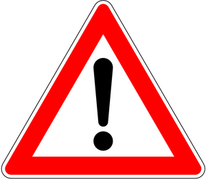
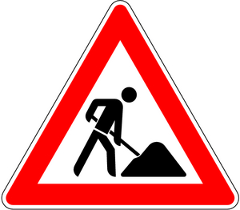

#**Traffic Sign Recognition**

##Writeup Template

###You can use this file as a template for your writeup if you want to submit it as a markdown file, but feel free to use some other method and submit a pdf if you prefer.

---

**Build a Traffic Sign Recognition Project**

The goals / steps of this project are the following:
* Load the data set (see below for links to the project data set)
* Explore, summarize and visualize the data set
* Design, train and test a model architecture
* Use the model to make predictions on new images
* Analyze the softmax probabilities of the new images
* Summarize the results with a written report

[//]: # (Image References)

[image1]: ./examples/visualization.jpg "Visualization"
[image2]: ./examples/grayscale.jpg "Grayscaling"
[image3]: ./examples/random_noise.jpg "Random Noise"
[image4]: ./examples/placeholder.png "Traffic Sign 1"
[image5]: ./examples/placeholder.png "Traffic Sign 2"
[image6]: ./examples/placeholder.png "Traffic Sign 3"
[image7]: ./examples/placeholder.png "Traffic Sign 4"
[image8]: ./examples/placeholder.png "Traffic Sign 5"

## Rubric Points
###Here I will consider the [rubric points](https://review.udacity.com/#!/rubrics/481/view) individually and describe how I addressed each point in my implementation.  

---
###Writeup / README

####1. Provide a Writeup / README that includes all the rubric points and how you addressed each one. You can submit your writeup as markdown or pdf. You can use this template as a guide for writing the report. The submission includes the project code.

You're reading it! and here is a link to my [project code](https://github.com/udacity/CarND-Traffic-Sign-Classifier-Project/blob/master/Traffic_Sign_Classifier.ipynb)

###Data Set Summary & Exploration

####1. Provide a basic summary of the data set and identify where in your code the summary was done. In the code, the analysis should be done using python, numpy and/or pandas methods rather than hardcoding results manually.

The code for this step is contained in the second code cell of the IPython notebook.  

I used the numpy library to calculate summary statistics of the traffic
signs data set:

* The size of training set is 34799
* The size of test set is 12630
* The shape of a traffic sign image is 32, 32, 3
* The number of unique classes/labels in the data set is 43

####2. Include an exploratory visualization of the dataset and identify where the code is in your code file.

The code for this step is contained in the third code cell of the IPython notebook.  

These are a random selection of 25 images from the training dataset:

Here is a plot of the classes in the training dataset.

###Design and Test a Model Architecture

####1. Describe how, and identify where in your code, you preprocessed the image data. What tecniques were chosen and why did you choose these techniques? Consider including images showing the output of each preprocessing technique. Pre-processing refers to techniques such as converting to grayscale, normalization, etc.

Image processing:

Augment brightness

Normalise image

As a last step, I normalized the image data because ...

####2. Describe how, and identify where in your code, you set up training, validation and testing data. How much data was in each set? Explain what techniques were used to split the data into these sets. (OPTIONAL: As described in the "Stand Out Suggestions" part of the rubric, if you generated additional data for training, describe why you decided to generate additional data, how you generated the data, identify where in your code, and provide example images of the additional data)

The code for splitting the data into training and validation sets is contained in the fifth code cell of the IPython notebook.  

To cross validate my model, I randomly split the training data into a training set and validation set. I did this by ...

My final training set had X number of images. My validation set and test set had Y and Z number of images.

The sixth code cell of the IPython notebook contains the code for augmenting the data set. I decided to generate additional data because ... To add more data to the the data set, I used the following techniques because ...

The difference between the original data set and the augmented data set is the following ...

####3. Describe, and identify where in your code, what your final model architecture looks like including model type, layers, layer sizes, connectivity, etc.) Consider including a diagram and/or table describing the final model.

The code for the final model I used is based on the standard LeNet, during testing I was having problems with overfitting, my Test Accuracy = 0.862 and my Training Accuracy = 0.968 and the Validation accuracy would dropping every so often. I added and additional dropout to both of the Convolutional layers between the activation and pooling which made a big difference in consistency.

My final model consisted of the following layers:

| Layer         		|     Description	        					|
|:---------------------:|:---------------------------------------------:|
| Input         | 32x32x1   			 |
| Convolution   | outputs 28x28x6  |
| RELU					|									 |
| Dropout       | 0.8              |
| Max pooling   | inputs 28x28x6 outputs 14x14x6 |
| Convolution   | outputs 10x10x16 |
| RELU          |                  |
| Dropout       | 0.8              |
| Max pooling	  | outputs 5x5x16 	 |
| Flatten       | outputs 400      |
| Fully connected		| output 120   |
| RELU				  |                  |
| Dropout   		|	0.8              |
| Fully connected| output 84       |
| Relu          |                  |
| Dropout       | 0.8              |
| Fully connected| output 43       |

Training model hyper parameters
Epochs: 50
Batch Size: 128
Learning rate 0.005

The code for training the model is located in the eighth cell of the ipython notebook.

To train the model, I used an ....

####5. Describe the approach taken for finding a solution. Include in the discussion the results on the training, validation and test sets and where in the code these were calculated. Your approach may have been an iterative process, in which case, outline the steps you took to get to the final solution and why you chose those steps. Perhaps your solution involved an already well known implementation or architecture. In this case, discuss why you think the architecture is suitable for the current problem.

The code for calculating the accuracy of the model is located in the ninth cell of the Ipython notebook.

My final model results were:
* training set accuracy of 0.994
* validation set accuracy of 0.962
* test set accuracy of 0.896

If an iterative approach was chosen:
* What was the first architecture that was tried and why was it chosen?
* What were some problems with the initial architecture?
* How was the architecture adjusted and why was it adjusted? Typical adjustments could include choosing a different model architecture, adding or taking away layers (pooling, dropout, convolution, etc), using an activation function or changing the activation function. One common justification for adjusting an architecture would be due to over fitting or under fitting. A high accuracy on the training set but low accuracy on the validation set indicates over fitting; a low accuracy on both sets indicates under fitting.
* Which parameters were tuned? How were they adjusted and why?
* What are some of the important design choices and why were they chosen? For example, why might a convolution layer work well with this problem? How might a dropout layer help with creating a successful model?

If a well known architecture was chosen:
* What architecture was chosen?
* Why did you believe it would be relevant to the traffic sign application?
* How does the final model's accuracy on the training, validation and test set provide evidence that the model is working well?

###Test a Model on New Images

####1. Choose five German traffic signs found on the web and provide them in the report. For each image, discuss what quality or qualities might be difficult to classify.

Here are five German traffic signs that I found on the web:

Here are the results of the prediction:

| Image			        |     Prediction	        					|
|:---------------------:|:---------------------------------------------:|
| General caution      		| General caution   									|
| Yield     			| Yield 										|
| Road work					| Road work											|
| 60 km/h	      		| 60 km/h					 				|
| Children crossing			| Children crossing      							|

The model was able to correctly guess 5 of the 5 traffic signs, which gives an accuracy of 100%.
